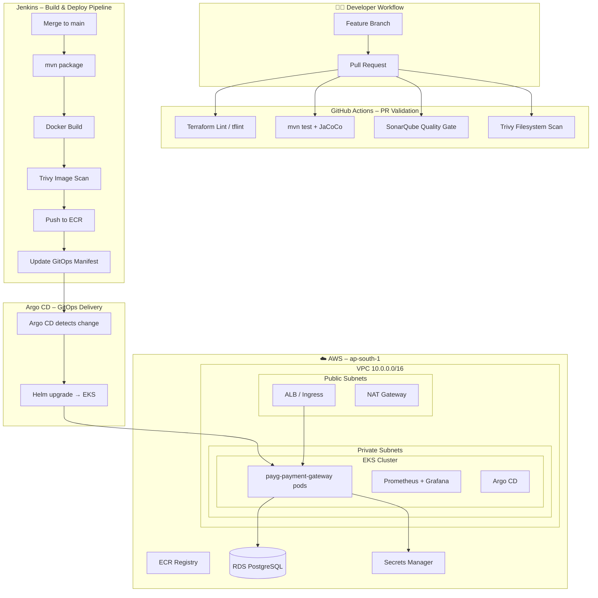

# Enterprise DevOps Platform – PayG Plus

> A production-grade DevOps reference platform built on AWS EKS, demonstrating end-to-end CI/CD, GitOps, observability, and security practices for a FinTech payment gateway processing **1M+ monthly transactions**.

---

## Repository Structure

```
enterprise-devops-platform/
├── application/          ← Spring Boot Payment Gateway (this repo)
├── infrastructure/       ← Terraform IaC (VPC, EKS, ECR, IAM)
├── helm-charts/          ← Helm charts for app + monitoring stack
├── gitops-manifests/     ← Argo CD application manifests (env overlays)
├── ansible-automation/   ← Ansible playbooks (Jenkins, SonarQube setup)
└── devops-scripts/       ← Utility shell scripts (ECR push, rollback, etc.)
```

## Architecture Overview



## Technology Stack

| Layer | Technology |
|---|---|
| Application | Spring Boot 3.2, Java 17 |
| Container | Docker (multi-stage, non-root) |
| Registry | AWS ECR (immutable tags, scan-on-push) |
| Orchestration | AWS EKS 1.29 |
| IaC | Terraform 1.6+ (modular, S3 backend) |
| CI – PR | GitHub Actions |
| CI – Build/Deploy | Jenkins (Declarative Pipeline) |
| GitOps | Argo CD (App-of-Apps) |
| Packaging | Helm 3 |
| Monitoring | Prometheus + Grafana |
| Security | Trivy, SonarQube, RBAC, KMS |
| Secrets | AWS Secrets Manager + External Secrets Operator |

---

## Day 1 – What's in this phase

- [x] Spring Boot Payment Gateway application (REST API, JPA, Prometheus metrics)
- [x] Multi-stage Dockerfile (non-root user, JVM container tuning)
- [x] Terraform modules: VPC, EKS, ECR, IAM, S3 Backend
- [x] Dev environment Terraform root module
- [x] DevOps utility scripts

## Day 2 – Coming next

- [ ] GitHub Actions – PR validation workflow (Trivy + SonarQube)
- [ ] Jenkinsfile – Declarative build/push/deploy pipeline
- [ ] Helm chart – payg-payment-gateway with HPA + ServiceMonitor
- [ ] Argo CD – App-of-Apps configuration
- [ ] GitOps manifests – dev/prod overlays
- [ ] Ansible playbooks – Jenkins + SonarQube provisioning

## Day 3 – Final phase

- [ ] kube-prometheus-stack Helm values
- [ ] Grafana dashboard JSON (JVM + EKS cluster)
- [ ] RBAC policies + NetworkPolicies
- [ ] Trivy admission webhook config
- [ ] Full README with screenshots + branching strategy

---

## Quick Start – Day 1

### Prerequisites

```bash
# Tools required
aws --version          # AWS CLI v2
terraform --version    # >= 1.6.0
docker --version       # >= 24.0
trivy --version        # >= 0.50.0
kubectl version        # >= 1.29
helm version           # >= 3.14
```

### 1. Bootstrap Terraform Remote State

```bash
cd infrastructure/modules/s3-backend
# Manually create once (bootstraps the backend)
terraform init
terraform apply -var="state_bucket_name=payg-terraform-state-dev"
```

### 2. Provision Infrastructure (Dev)

```bash
cd infrastructure/environments/dev
terraform init
terraform plan -out=tfplan
terraform apply tfplan
```

### 3. Configure kubectl

```bash
./devops-scripts/update-kubeconfig.sh payg-eks-dev ap-south-1
kubectl get nodes
```

### 4. Build & Push Application Image

```bash
./devops-scripts/ecr-push.sh v1.0.0 ap-south-1
```

---

## Key Design Decisions

**Why separate node groups?** System node group (with taint `CriticalAddonsOnly`) isolates CoreDNS, VPC CNI, and Argo CD from application workloads, preventing resource contention.

**Why IRSA over node-level IAM?** Instance Role for Service Accounts (IRSA) enforces least privilege at the pod level. The payment gateway pod only gets Secrets Manager access; nothing else.

**Why immutable ECR tags?** Prevents silent overwriting of deployed images. Every image is uniquely tagged (git SHA + timestamp), giving full deployment auditability.

**Why KMS for EKS secrets encryption?** Kubernetes secrets stored in etcd are encrypted at rest using a customer-managed KMS key, satisfying PCI-DSS data protection requirements for a payment platform.
